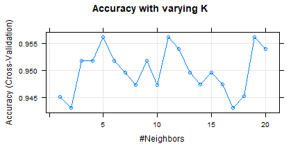
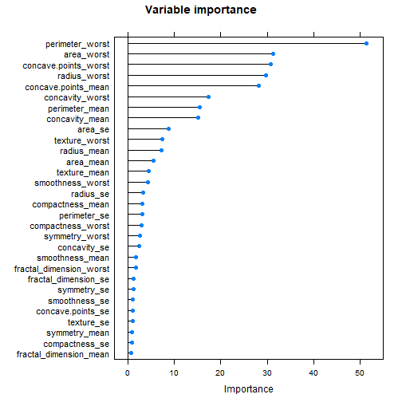
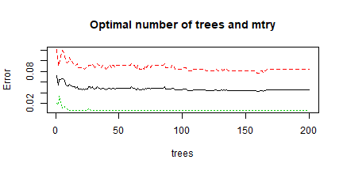
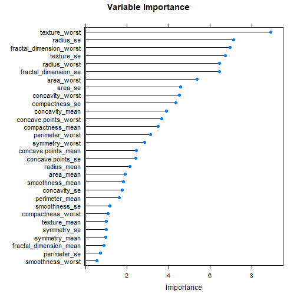
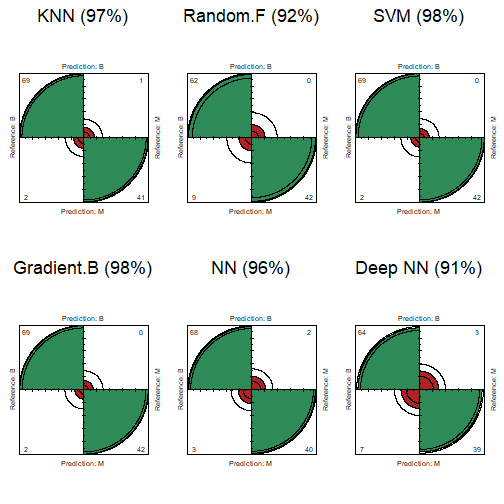
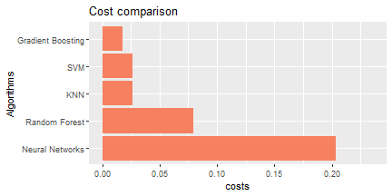

# Breast Cancer Machine Learning Study

### Introduction

The goal of this project was to create models to classify breast tumors as benign or malign using machine learning tools. The results obtained showed an exceptional performance that prove that the final model of the project could be indeed used as a clinical tool for cancer diagnosis.

Since the first part of the project already had a long introduction, we will directly dive into the second part.

The project can be also seen in its shiny version in the following web page:
https://daniellapidomartinez.shinyapps.io/BreastCancer_ML/ (It takes around a minute to load)

### Machine learning tools and hyperparameter tuning

#### KNN

The KNN algorithm assumes that similar things are near to each other. It classifies objects by assigning them to the class most common among its k nearest neighbors. Therefore, the most important hyperparameter is the number of neighbors. In the following plot we can see the accuracy of the model for several values of k.

**Hyperparameter tuning with cross-validation**

5-fold cross validation is employed for all methods. That means that the training test is divided in 5 partitions. The first four partitions are used for training the model and the fifth one is used for validation. This is done 5 times in total. (The testing set is not used in any way while training the model)

**Test accuracy**

|   |  B|  M|
|:--|--:|--:|
|B  | 69|  1|
|M  |  2| 41|

|               |      x|
|:--------------|------:|
|Accuracy       | 0.9735|
|Kappa          | 0.9434|
|AccuracyLower  | 0.9244|
|AccuracyUpper  | 0.9945|
|AccuracyNull   | 0.6283|
|AccuracyPValue | 0.0000|
|McnemarPValue  | 1.0000|

#### Random Forest

Random forest is an ensemble of a large number of decision trees . Each individual tree in the random forest leads to a class prediction and the class with the most votes becomes our model's prediction. The most important hyperparameters are the number of branches that will grow after each time split(ntree) and the number of variables that are randomly collected to be sampled at each split time (mtry).

**Hyperparameter tuning**

The following plots shows the variable importance for the random forest algorithm and the tunned hyperparameters.

**Test accuracy**

|   |  B|  M|
|:--|--:|--:|
|B  | 62|  0|
|M  |  9| 42|

|               |      x|
|:--------------|------:|
|Accuracy       | 0.9204|
|Kappa          | 0.8366|
|AccuracyLower  | 0.8542|
|AccuracyUpper  | 0.9629|
|AccuracyNull   | 0.6283|
|AccuracyPValue | 0.0000|
|McnemarPValue  | 0.0077|

#### Support Vector Machines

The principle behind an SVM classifier (Support Vector Machine) algorithm is to build a hyperplane separating data for different classes. The main focus while drawing the hyperplane is on maximizing the distance from hyperplane to the nearest data point of either class. These nearest data points are known as Support Vectors.

**Test accuracy**

|   |  B|  M|
|:--|--:|--:|
|B  | 69|  0|
|M  |  2| 42|

\vspace{1cm}

|               |      x|
|:--------------|------:|
|Accuracy       | 0.9823|
|Kappa          | 0.9625|
|AccuracyLower  | 0.9375|
|AccuracyUpper  | 0.9978|
|AccuracyNull   | 0.6283|
|AccuracyPValue | 0.0000|
|McnemarPValue  | 0.4795|

#### Gradient Boosting

This machine learning technique produces a prediction model in the form of an ensemble of weak prediction models. Instead of using the error of each weak learner, it defines a loss function and use the gradient descent to minimize the loss by adding weak learners. It has very good predictive power but it is computationally expensive. For that reason the hyperparameters where not thoroughly tunned.

**Test accuracy**

|   |  B|  M|
|:--|--:|--:|
|B  | 69|  0|
|M  |  2| 42|

|               |      x|
|:--------------|------:|
|Accuracy       | 0.9823|
|Kappa          | 0.9625|
|AccuracyLower  | 0.9375|
|AccuracyUpper  | 0.9978|
|AccuracyNull   | 0.6283|
|AccuracyPValue | 0.0000|
|McnemarPValue  | 0.4795|

#### Neural networks

Neural Networks are a family of Machine Learning techniques that are capable of extracting hidden patterns within data. Since we do not have a large number of observations, it may not perform as well as the rest of the methods.

The most important variables for this algorithm can be seen in the next plot. As an interesting result, we can say that the most important variables for the neural network do not match the ones of the random forest.

**Test accuracy**

|   |  B|  M|
|:--|--:|--:|
|B  | 68|  2|
|M  |  3| 40|

|               |      x|
|:--------------|------:|
|Accuracy       | 0.9558|
|Kappa          | 0.9057|
|AccuracyLower  | 0.8998|
|AccuracyUpper  | 0.9855|
|AccuracyNull   | 0.6283|
|AccuracyPValue | 0.0000|
|McnemarPValue  | 1.0000|

#### Deep Neural Network

A deep neural network is an artificial neural network with multiple layers between the input and output layers. Using this method on our dataset is like using a sledgehammer to crack a nut. The results are expected to be the worst ones of all the methods since we count on too little observations.

Due to the the data being a little unbalanced, smote sampling was used in order to avoid the Deep Neural Network to classify all tumors in the same class.

**Test accuracy**

|   |  B|  M|
|:--|--:|--:|
|B  | 64|  3|
|M  |  7| 39|

|               |      x|
|:--------------|------:|
|Accuracy       | 0.9115|
|Kappa          | 0.8141|
|AccuracyLower  | 0.8433|
|AccuracyUpper  | 0.9567|
|AccuracyNull   | 0.6283|
|AccuracyPValue | 0.0000|
|McnemarPValue  | 0.3428|

### Comparison of results

Here is a summary of the results obtained through all methods:

\vspace{2cm}

|Algorithm            | Accuracy|  Kappa| True negatives| True positives| False positives| False negatives|
|:--------------------|--------:|------:|--------------:|--------------:|---------------:|---------------:|
|KNN                  |   0.9735| 0.9434|             69|             41|               2|               1|
|Random Forest        |   0.9204| 0.8366|             62|             42|               9|               0|
|SVM                  |   0.9823| 0.9625|             69|             42|               2|               0|
|Gradient Boosting    |   0.9823| 0.9625|             69|             42|               2|               0|
|Neural Networks      |   0.9558| 0.9057|             68|             40|               3|               2|
|Deep Neural Networks |   0.9115| 0.8141|             64|             39|               7|               3|

All methods performed very well, with an accuracy over $90\%$, in particular gradient boosting, support vector machines and KNN had the highest kappa and accuracy. On the other hand, Random forest and deep neural network obtained the worst results. Although Random forest has the second largest amount of errors, it is noticeable the total absence of false negative errors. In the next section we will further explore the importance of each type of errors.

### Cost-sensitive learning

Given the results obtained in the previous section, we can be confident about the splending performance of our models. Nonetheless, we have been considering missclasification errors as equally important.  Now we are going to see the differences in the cost of the two errors.

The first scenario is misclassifying malignant tumor as benign ones, which may lead the patients to miss the best treatment time and cause the disease to deteriorate. It could very possibly lead to a life-threatening situation.

The second scenario is misclassifying benign breast tumors as malignant ones which may lead the patients to take the wrong drugs and cause some side effects.

In order to take into account the unequal consecuences of the errors, we create the following cost matrix:

|   |B        |M        |
|:--|:--------|:--------|
|B  |0        |Cost~BM~ |
|M  |Cost~MB~ |0        |

The cost matrix is built in terms of the patients health, not the economic cost associated with each diagnosis. For that reason, the cost of true positives and the cost of true negatives is zero. The first scenario that we mentioned above was the worse one, so we set $Cost_{BM} = 10$ and $Cost_{MB}=1$.  

The models will be trained again, but this time their hyperparameters will be tunned based on the cost matrix instead of the accuracy. So we will get less false negatives at the expense of increasing false positives.

#### Random Forest

|   |  B|  M|
|:--|--:|--:|
|B  | 62|  0|
|M  |  9| 42|

|               |      x|
|:--------------|------:|
|Accuracy       | 0.9204|
|Kappa          | 0.8366|
|AccuracyLower  | 0.8542|
|AccuracyUpper  | 0.9629|
|AccuracyNull   | 0.6283|
|AccuracyPValue | 0.0000|
|McnemarPValue  | 0.0077|

#### KNN

|   |  B|  M|
|:--|--:|--:|
|B  | 68|  0|
|M  |  3| 42|

|               |      x|
|:--------------|------:|
|Accuracy       | 0.9735|
|Kappa          | 0.9440|
|AccuracyLower  | 0.9244|
|AccuracyUpper  | 0.9945|
|AccuracyNull   | 0.6283|
|AccuracyPValue | 0.0000|
|McnemarPValue  | 0.2482|

#### SVM

|   |  B|  M|
|:--|--:|--:|
|B  | 68|  0|
|M  |  3| 42|

|               |      x|
|:--------------|------:|
|Accuracy       | 0.9735|
|Kappa          | 0.9440|
|AccuracyLower  | 0.9244|
|AccuracyUpper  | 0.9945|
|AccuracyNull   | 0.6283|
|AccuracyPValue | 0.0000|
|McnemarPValue  | 0.2482|

#### Gradient Boosting

|   |  B|  M|
|:--|--:|--:|
|B  | 69|  0|
|M  |  2| 42|

|               |      x|
|:--------------|------:|
|Accuracy       | 0.9823|
|Kappa          | 0.9625|
|AccuracyLower  | 0.9375|
|AccuracyUpper  | 0.9978|
|AccuracyNull   | 0.6283|
|AccuracyPValue | 0.0000|
|McnemarPValue  | 0.4795|

#### Neural networks

|   |  B|  M|
|:--|--:|--:|
|B  | 68|  2|
|M  |  3| 40|

|               |      x|
|:--------------|------:|
|Accuracy       | 0.9558|
|Kappa          | 0.9057|
|AccuracyLower  | 0.8998|
|AccuracyUpper  | 0.9855|
|AccuracyNull   | 0.6283|
|AccuracyPValue | 0.0000|
|McnemarPValue  | 1.0000|

### Cost sensitive learning results

According to this graph, the method with the least associated health cost is Gradient boosting, that despite of not having rigorously tunned hyperparameters, only commited two false positive errors.

While Knn improved its performance, SVM got a little worse misclassifying an extra observation. With the exception of the neural network, all the models managed to not commit false negative errors.

### Final model creation

We have trained several models and some of them performed better than others. The best one was the Gradient boosting model, however, getting good results in the past does not garantee getting good results in the future. In other words: the model that better performed in our testing set, might not be the best model in classifying new observations. In fact we can not know which model will be the best. 

The final model will not be a single one but an ensemble of the best classifiers, that is, a combination of the best models that we created.

The Ensemble model will be a combination of the Gradient Boosting model, KNN, SVM and penalized logistic regression.

|   |  B|  M|
|:--|--:|--:|
|B  | 70|  0|
|M  |  1| 42|

|               |      x|
|:--------------|------:|
|Accuracy       | 0.9912|
|Kappa          | 0.9811|
|AccuracyLower  | 0.9517|
|AccuracyUpper  | 0.9998|
|AccuracyNull   | 0.6283|
|AccuracyPValue | 0.0000|
|McnemarPValue  | 1.0000|

The results of the final model were almost perfect. No false negatives and only one false positive. Although this does not mean that the model is going to perfectly classify new observations, we can be proud of the model's performance.

### Conclusions

Without any knowledge of medicine, the machine learning tools allowed us to create a very powerfull model that could be indeed used as a clinical tool. Out of 113 patients, only one of them received an incorrect diagnosis.

Thanks to the cost-sensitive learning, that particular wrong diagnosis was just a false positive error. That means that the patient was initially told that the tumor was malign but at the end it turned out to be benign, so no further consecuences happened due to that error. 

