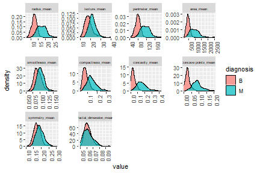

# Breast cancer study

Breast cancer is the most frequent cancer type
within women of all around the world. Although the rates are higher in developed countries, it is spreading worldwide.
It was the most frequent death cause in 11 regions of the world.

More information is available every year to early diagnose breast cancer,
which is crucial in the prognosis and chance of survival.
The accurate classification of tumors is vital in order
to start a quick treatment for malign ones and to not force patients to go through unnecesary therapy in the benign cases.


The Breast Cancer dataset contains data on 30 predictors and the objective is to predict
the probability that somebody has a malign tumor.

Data can be found in UCI Machine Learning Repository: https://archive.ics.uci.edu/ml/datasets/Breast+Cancer+Wisconsin+(Diagnostic)

# Pre-processing and analyzing the data

Before doing anything, lets examine the data looking for missing values, outliers and unnecesary features.

All variables are continous and there are no missing values. We notice that there is an identification number that is not useful for classification, so we remove it. (However it must be saved in case we needed to contact the patient!)


```
##  [1] "id"                      "diagnosis"               "radius_mean"             "texture_mean"           
##  [5] "perimeter_mean"          "area_mean"               "smoothness_mean"         "compactness_mean"       
##  [9] "concavity_mean"          "concave points_mean"     "symmetry_mean"           "fractal_dimension_mean" 
## [13] "radius_se"               "texture_se"              "perimeter_se"            "area_se"                
## [17] "smoothness_se"           "compactness_se"          "concavity_se"            "concave points_se"      
## [21] "symmetry_se"             "fractal_dimension_se"    "radius_worst"            "texture_worst"          
## [25] "perimeter_worst"         "area_worst"              "smoothness_worst"        "compactness_worst"      
## [29] "concavity_worst"         "concave points_worst"    "symmetry_worst"          "fractal_dimension_worst"
```


## Outlier detection

Some boxplots are employed in order to visualize extreme values.
We can see that there are plenty of outliers but there is no reason to think that those are typos. We will not remove them as those larger values will probably indicate a higher likelihood of malignancy


## Density distributions



We can see that some variables are better for classification than others.
For example radius, perimeter, area and concavity mean classify reasonably well whereas smoothness_mean and fractal dimension mean do not look appropiate at all.

Regarding standard error distributions, we can see that perimeter_se
and area_se could be useful for classification, while texture_se and
smoothness_se would be horrible.

Finally, we can see that radius_worst, perimeter_worst, area_worst
and concave points_worst are good for classification.

We have now an idea of which variables look good for classification,
however, it is possible that the dataset contains redundant information about the response because some of these predictors may be correlated.
If that is the case, perhaps we could drop some of the predictors, as 
having more variables is not necessary better. Too many predictors will add unwanted noise to the problem and will probably invalid the explanatory purpose of the model. 


Indeed there are a lot of strong correlated variables. The problem now is to decide what to do with them, and if we decide to drop some them, which ones shall we drop.

As we are dealing with a binary classification problem, we can anticipate that logistic regression will perform well.
Bearing that in mind, we will create a logistic regression model with previous manual variable selection in order to avoid introducing a large bias in the estimation. After that, we will create a penalized logistic regression model and see which one performs better.

##Variable selection for highly correlated predictors

Variable selection can be done automatically or manually.
In the second part of the project we will use \textbf{Recursive Feature elimination} which is an optimization algorithm that aims to find the best performing predictors subset. However, for this first part we will drop those correlated variables that are worse for classification in terms of the above density plots.

Radious_mean, perimeter_mean and area_mean are strongly correlated.By looking at their density plots, we can see that the variable that better classifies is area_mean(less region in common between Benign and Malign). Thus we also choose area_se, area_worst and drop the other variables.

Compactness_mean, concavity_mean and concave points_mean are also strongly correlated. Among them, we could argue that concave points_mean and concavity_mean classify well, however, since concave_points seem correlated with area_mean, the chosen feature is concavity_mean. Therefore concavity_se and concavity_worst are also selected.

Finally we keep texture_mean over texture_worst and area_mean over area_worst.

After all this manual variable selection, the predictors have been reduced from 30 to 16. As a summary, these are the main predictors affecting the output:


```
##  [1] "texture_mean"            "area_mean"               "smoothness_mean"         "concavity_mean"         
##  [5] "symmetry_mean"           "fractal_dimension_mean"  "texture_se"              "area_se"                
##  [9] "smoothness_se"           "concavity_se"            "symmetry_se"             "fractal_dimension_se"   
## [13] "smoothness_worst"        "concavity_worst"         "symmetry_worst"          "fractal_dimension_worst"
```

# Classification modeling using statistical tools  

There are plenty of classification models that relay in statistical tools. We will go over some of them and compare their results in order to determine which one is the best.

First of all we split the data into training (70 \%) and testing sets. The models will be initially fitted on the training dataset, and then their performance will be checked with the testing dataset.


## Logistic regression model

As we said before, we expect good performance by this model as we are dealing with a binary classification problem. In order to get true errors 5-fold cross validation was carried out when training the model.


The following results prove that logistic regression was very effective. We can see that the accuracy is very high and that the errors are balanced. It is true that the data is a little bit unbalanced but it is almost a 60\% - 40\% situation.


|   |   B|  M|
|:--|---:|--:|
|B  | 105|  3|
|M  |   2| 60|


|               |         x|
|:--------------|---------:|
|Accuracy       | 0.9705882|
|Kappa          | 0.9367465|
|AccuracyLower  | 0.9327003|
|AccuracyUpper  | 0.9903825|
|AccuracyNull   | 0.6294118|
|AccuracyPValue | 0.0000000|
|McnemarPValue  | 1.0000000|

This results have been obtained for a threshold value = 0.5

Are the errors equally important? They are clearly not. It is worse to send home women incorrectly thinking that they do not have breast cancer (false negatives) than telling someone that has cancer but in the end she does not (false positives). So in order to avoid false negatives, we can increase the threshold value. However we can not find an optimal threshold as we are not able to quantify how much better is to get more false positives and less false negatives.

If we had not dropped correlated variables, we could have used penalized logistic regression which also gives very similar results:


|   |   B|  M|
|:--|---:|--:|
|B  | 106|  4|
|M  |   1| 59|


|               |         x|
|:--------------|---------:|
|Accuracy       | 0.9705882|
|Kappa          | 0.9363296|
|AccuracyLower  | 0.9327003|
|AccuracyUpper  | 0.9903825|
|AccuracyNull   | 0.6294118|
|AccuracyPValue | 0.0000000|
|McnemarPValue  | 0.3710934|


## LDA

This classification model performs better for multi-class classification, however we have already seen that we have very well separated groups, so LDA might perform as well as logistic regression. Nonetheless this method requires predictors to be somehow Gaussian.

Properly adjusting the prior probabilities, the results obtained are the following:


|   |   B|  M|
|:--|---:|--:|
|B  | 106| 15|
|M  |   1| 48|


|               |         x|
|:--------------|---------:|
|Accuracy       | 0.9058824|
|Kappa          | 0.7885901|
|AccuracyLower  | 0.8516596|
|AccuracyUpper  | 0.9452421|
|AccuracyNull   | 0.6294118|
|AccuracyPValue | 0.0000000|
|McnemarPValue  | 0.0011541|

Even though the accuracy is worse, the amount of false negatives (which are the type of errors that we would like to avoid) is still small.

## Naïve Bayes

Naïve Bayes is a fast classifier although requires the strong assumption of independance between predictors. Nonetheless we still give it a try and see how well it performs:


Correctly tunning the hyperparameters we can see that it still performs well.

|   |   B|  M|
|:--|---:|--:|
|B  | 101| 10|
|M  |   6| 53|


|               |         x|
|:--------------|---------:|
|Accuracy       | 0.9058824|
|Kappa          | 0.7955809|
|AccuracyLower  | 0.8516596|
|AccuracyUpper  | 0.9452421|
|AccuracyNull   | 0.6294118|
|AccuracyPValue | 0.0000000|
|McnemarPValue  | 0.4532547|


# Some Machine Learning tools

The analysis using Machine Learning models is included in the [ML_models.md file](https://github.com/DanielLapido/Breast_cancer/blob/main/ML_models.md), however some machine learning tools are included here to compare their performance with the previous models. Their main advanage is that they do do not need any previous assumptions from the data. Lets see if they end up performing better than the logistic regression model:

## KNN

kNN requires variables to be normalized or scaled, so we center and scale the data.


|   |   B|  M|
|:--|---:|--:|
|B  | 104| 11|
|M  |   3| 52|


|               |         x|
|:--------------|---------:|
|Accuracy       | 0.9176471|
|Kappa          | 0.8187357|
|AccuracyLower  | 0.8656858|
|AccuracyUpper  | 0.9542453|
|AccuracyNull   | 0.6294118|
|AccuracyPValue | 0.0000000|
|McnemarPValue  | 0.0613688|

We get good results, but perhaps the high dimension n/p prevented it from performing better.

## Support Vector machines

Since n is not too large we will finally use Support Vector machines. As they do not suffer from collinearity we expect good results.


|   |   B|  M|
|:--|---:|--:|
|B  | 105|  7|
|M  |   2| 56|


|               |         x|
|:--------------|---------:|
|Accuracy       | 0.9470588|
|Kappa          | 0.8846328|
|AccuracyLower  | 0.9018824|
|AccuracyUpper  | 0.9755092|
|AccuracyNull   | 0.6294118|
|AccuracyPValue | 0.0000000|
|McnemarPValue  | 0.1824224|

Exceptional performance and no assumptions were needed of the data.


# Conclusions

All statistical models used performed brilliantly with the dataset employed. Although it was real data, this is pretty unusual and we would normally never get such a high accuracy (over 90\% with all models).

Every model has positive and negative things as we have been discussing through the project. Looking at the results, we could argue that the one that have better performed was the logistic regression model, even though it required to previously remove strongly correlated variables for the algorithm to converge. This variable selection was carried out manually so it is highly probable that the final predictors were not the optimal ones, in fact it is possible that too many variables were dropped. This could have been done with an automatic procedure, however we would have not gainned that much innsight. 
